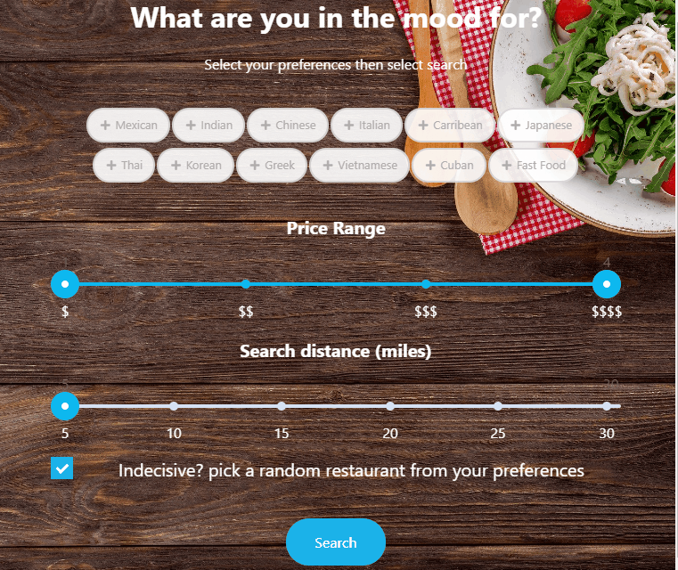

# Food Picker
Web application that helps you decide where to eat or allows you to explore multiple options.
Perfect for indecisive girlfriends. Try it out at https://foodpicker.net :fork_and_knife:

# Technologies used
- VSCode
- Angular
- Firebase cloud functions and hosting
- Google map and places API
- Node and Express

# What I learned
- CORS/working with http params and headers
- Create an API with cloud functions and Express
- Handle requests and responses
- Became more familiar with status codes
- Set up google map and use markers

# Demo

